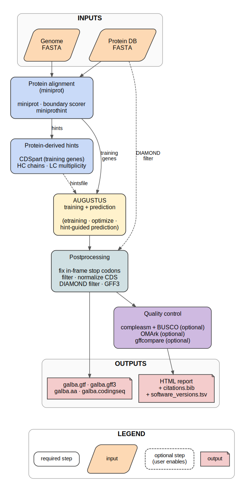

<p align="center"></p>

<p align="center">
  <a href="https://github.com/Gaius-Augustus/GALBA2/releases"></a>
  <a href="LICENSE"></a>
  
  
</p>

# GALBA2 — protein homology based genome annotation in Snakemake

Author: Katharina J. Hoff

Contact for Repository
========================

Katharina J. Hoff, University of Greifswald, Germany, katharina.hoff@uni-greifswald.de, +49 3834 420 4624

> **Migrating from GALBA (`galba.pl`)?** GALBA2 reimplements the same protein-to-genome annotation pipeline as a Snakemake workflow. The prediction logic is unchanged: miniprot aligns proteins, miniprothint generates training genes and hints, AUGUSTUS is trained and predicts genes. The key differences are automatic resume, HPC support, and containerized execution.

Contents
========

-   [What is different in GALBA2?](#what-is-different-in-galba2)
-   [What is GALBA?](#what-is-galba)
-   [Keys to successful gene prediction](#keys-to-successful-gene-prediction)
-   [Protein database preparation](#protein-database-preparation)
-   [Installation](#installation)
    -   [Snakemake](#snakemake)
    -   [Singularity](#singularity)
-   [Running GALBA2](#running-galba2)
    -   [Preparing input files](#preparing-input-files)
        -   [samples.csv](#samplescsv)
        -   [config.ini](#configini)
    -   [Running locally](#running-locally)
    -   [Running on an HPC cluster with SLURM](#running-on-an-hpc-cluster-with-slurm)
    -   [Description of selected configuration options](#description-of-selected-configuration-options)
-   [Output of GALBA2](#output-of-galba2)
-   [Example data](#example-data)
-   [Bug reporting](#bug-reporting)
-   [Citing GALBA2 and software called by GALBA2](#citing-galba2-and-software-called-by-galba2)
-   [License](#license)

What is different in GALBA2?
=============================

GALBA2 is a rewrite of the [GALBA pipeline](https://github.com/Gaius-Augustus/GALBA) in Snakemake, based on the [BRAKER4](https://github.com/Gaius-Augustus/BRAKER4) framework. The gene prediction logic is the same: miniprot aligns proteins to the genome, miniprothint extracts training genes and protein hints, AUGUSTUS is trained on the protein-derived genes and predicts with protein hints. What changed is how this logic is orchestrated.

**The old GALBA** was a monolithic Perl script (`galba.pl`, ~275 KB). It managed all tool calls, error handling, and file paths in a single script. It could not resume after failures and did not natively support cluster execution.

**GALBA2** replaces that script with a Snakemake workflow. All bioinformatics tools run inside a Singularity container. You do not install miniprot, AUGUSTUS, DIAMOND, or any of their dependencies on your system. Snakemake handles job scheduling, parallelization, and automatic resume after failures.

Key differences:

-   **CSV-based multi-sample input.** You can annotate multiple genomes in a single run. Each row in `samples.csv` defines one genome with its protein evidence.

-   **Automatic resume.** If a run fails (out of memory, time limit, network error), re-run the same command. Snakemake picks up where it left off.

-   **Modular rules.** Each step is a separate Snakemake rule in its own file. This makes it straightforward to understand, debug, and extend the pipeline.

-   **HPC-ready with SLURM.** Snakemake's SLURM executor submits each rule as a separate cluster job.

-   **Integrated postprocessing and quality control.** GFF3 conversion (AGAT), DIAMOND filtering against input proteins, BUSCO/compleasm completeness assessment, and optional evaluation against a reference annotation (gffcompare) are included.

What is GALBA?
===============

GALBA is a pipeline for genome annotation using protein homology. It is designed for cases where no RNA-Seq data is available, but a database of protein sequences from related species exists. GALBA uses miniprot to align proteins to the genome, generates training genes from high-quality alignments, trains AUGUSTUS on these genes, and predicts genes using protein-derived hints.

GALBA is particularly useful for:

-   **Novel species** without RNA-Seq data, where a protein database from related species is available.
-   **Large-scale annotation projects** where dozens of genomes need to be annotated with the same protein database.
-   **Species with high-quality protein databases** (e.g. from OrthoDB) but no transcriptome evidence.

<p align="center">
  
  <br>
  <em>Figure&nbsp;1. Overview of the GALBA2 pipeline. Solid borders mark required steps; dashed borders mark optional steps. Miniprot aligns proteins to the genome, miniprothint extracts training genes and hints, AUGUSTUS is trained and predicts genes with protein evidence.</em>
</p>

Keys to successful gene prediction
====================================

-   Use a high quality genome assembly. If you have a huge number of very short scaffolds, those will increase runtime but not prediction accuracy.

-   Use simple scaffold names in the genome file (e.g. `>contig1`). Complex headers can cause parsing issues.

-   The genome should be soft-masked for repeats. Soft-masking (lowercase letters for repeats) leads to better results than hard-masking (replacing with `N`). If you provide an unmasked genome, GALBA2 will still run but prediction quality may suffer in repetitive regions.

-   Always check gene prediction results before further usage. You can use a genome browser for visual inspection of gene models in context with protein alignments.

Protein database preparation
=============================

For the `protein_fasta` input, we recommend using a relevant clade partition from [OrthoDB](https://www.orthodb.org/). Pre-partitioned OrthoDB v12 files are available for download at:

**https://bioinf.uni-greifswald.de/bioinf/partitioned_odb12/**

Select the partition that matches your target species (e.g. `Viridiplantae` for plants, `Metazoa` for animals, `Fungi` for fungi). GALBA2 ships a helper script that downloads and decompresses a partition in one step:

```bash
# Example: download Viridiplantae partition to current directory
bash scripts/download_orthodb.sh Viridiplantae

# Or specify an output directory (useful for sharing across runs)
bash scripts/download_orthodb.sh Viridiplantae /data/orthodb
```

Available clades: `Metazoa`, `Vertebrata`, `Viridiplantae`, `Arthropoda`, `Fungi`, `Alveolata`, `Stramenopiles`, `Amoebozoa`, `Euglenozoa`, `Eukaryota`.

You can also download manually:

```bash
wget https://bioinf.uni-greifswald.de/bioinf/partitioned_odb12/Viridiplantae.fa.gz
gunzip Viridiplantae.fa.gz
```

Any protein database will work as long as it contains many representatives per protein family. Single-species proteomes (e.g. only SwissProt entries for one organism) are **not suitable** — GALBA needs a broad database with multiple homologs per gene family.

Installation
============

**Platform requirement:** GALBA2 requires **Linux**. It relies on GNU coreutils (`readlink -f`), GNU grep (`grep -P`), and Singularity/Apptainer. If you are on macOS or Windows, run GALBA2 inside a Linux virtual machine or WSL2.

GALBA2 requires two things on your system: Snakemake and Singularity. All bioinformatics tools (miniprot, miniprothint, AUGUSTUS, DIAMOND, etc.) run inside the container. You do not need to install them.

Snakemake
---------

We recommend installing Snakemake with `pip` into a virtual environment:

```
python3 -m venv snakemake_env
source snakemake_env/bin/activate
pip install snakemake
```

If you intend to run GALBA2 on an HPC cluster with SLURM, you also need the Snakemake SLURM executor plugin:

```
pip install snakemake-executor-plugin-slurm
```

Singularity
-----------

Singularity (or Apptainer, its open-source successor) must be installed on your system. On most HPC clusters, it is already available as a module:

```
module load singularity
```

GALBA2 will automatically pull the container image and convert it to a Singularity image on the first run.

**Container image:**

| Container | Image | Size | Used for |
| --- | --- | --- | --- |
| GALBA | `katharinahoff/galba-notebook:latest` | 2.0 GB | miniprot, miniprothint, miniprot_boundary_scorer, AUGUSTUS, DIAMOND, compleasm, getAnnoFastaFromJoingenes — all pipeline rules |
| BUSCO | `ezlabgva/busco:v6.0.0_cv1` | 801 MB | BUSCO completeness assessment (optional) |
| AGAT | `quay.io/biocontainers/agat:1.4.1--pl5321hdfd78af_0` | 370 MB | GTF-to-GFF3 conversion |
| OMArk | `quay.io/biocontainers/omark:0.4.1--pyh7e72e81_0` | 455 MB | OMArk proteome quality assessment (optional, only when `run_omark = 1`) |
| gffcompare | `quay.io/biocontainers/gffcompare:0.12.6--h9f5acd7_1` | 11 MB | Evaluation against a reference annotation (optional) |

A full GALBA2 container cache is **roughly 3.6 GB** on disk with BUSCO and AGAT. Without optional QC containers, only the main GALBA container (~2 GB) is needed.

**Singularity bind paths:** Singularity containers can only see directories that are explicitly bound. GALBA2 passes `--singularity-args "-B /home"` by default. If your data resides outside `/home` (e.g. in `/scratch`, `/data`, or `/gpfs`), you must add those paths:

```
--singularity-args "-B /home -B /scratch -B /data"
```

Running GALBA2
===============

Preparing input files
---------------------

GALBA2 requires two configuration files in your working directory: `samples.csv` and `config.ini`.

### samples.csv

This CSV file defines your input samples. Each row is one genome to annotate.

```csv
sample_name,genome,genome_masked,protein_fasta,busco_lineage,reference_gtf
```

**Columns:**

| Column | Required | Description |
|--------|----------|-------------|
| `sample_name` | yes | Unique identifier. Output goes to `output/{sample_name}/`. |
| `genome` | yes | Path to genome FASTA file. |
| `genome_masked` | no | Path to soft-masked genome. If empty, the unmasked genome is used directly. |
| `protein_fasta` | **yes** | Protein sequences in FASTA format. Multiple files can be colon-separated. We recommend OrthoDB. |
| `busco_lineage` | **yes** | BUSCO lineage for QC (e.g. `eukaryota_odb12`, `arthropoda_odb12`). |
| `reference_gtf` | no | Reference annotation for gffcompare evaluation. Optional. |

**Example: annotating two genomes in one run**

```csv
sample_name,genome,genome_masked,protein_fasta,busco_lineage,reference_gtf
fly,fly_genome.fa,,orthodb_arthropoda.fa,arthropoda_odb12,
plant,plant_genome.fa,plant_masked.fa,orthodb_viridiplantae.fa,viridiplantae_odb12,reference.gtf
```

You can also combine multiple protein sources by colon-separating them:

```csv
sample_name,genome,genome_masked,protein_fasta,busco_lineage,reference_gtf
my_species,genome.fa,,orthodb.fa:close_relative.fa,eukaryota_odb12,
```

### config.ini

This file contains pipeline parameters. Place it in the same directory as your `samples.csv`.

```ini
[paths]
samples_file = samples.csv
augustus_config_path = augustus_config
; busco_download_path = shared_data/busco_downloads      # optional, auto-discovered
; compleasm_download_path = shared_data/compleasm_downloads  # optional, auto-discovered

[containers]
galba_image = docker://katharinahoff/galba-notebook:latest  # optional, this is the default

[PARAMS]
skip_optimize_augustus = 0          # set to 1 to skip AUGUSTUS optimization (saves time)
disable_diamond_filter = 0         # set to 1 to skip DIAMOND filtering of predictions
skip_busco = 0                     # set to 1 to skip the BUSCO pipeline
run_omark = 0                      # set to 1 to run OMArk (requires LUCA.h5 database)
translation_table = 1              # genetic code table (1=standard)
allow_hinted_splicesites = gcag,atac # non-canonical splice sites for AUGUSTUS
augustus_chunksize = 3000000        # genome chunk size (bp) for parallel AUGUSTUS prediction
augustus_overlap = 500000           # overlap (bp) between adjacent AUGUSTUS chunks
no_cleanup = 0                     # set to 1 to keep all intermediate files (debugging only)
use_dev_shm = 0                    # set to 1 to use /dev/shm for temp files (faster I/O)

[SLURM_ARGS]
cpus_per_task = 48
mem_of_node = 120000                # memory in MB
max_runtime = 4320                  # runtime in minutes (72 hours)
```

Every value in `[PARAMS]` and `[SLURM_ARGS]` can also be overridden via an environment variable named `GALBA2_<KEY_UPPER>`, e.g. `GALBA2_MAX_RUNTIME=240` or `GALBA2_SKIP_OPTIMIZE_AUGUSTUS=1`. Environment variables win over the file. The path of the file itself can be overridden with `GALBA2_CONFIG=/path/to/another.ini`.

Running locally
---------------

For running GALBA2 on a local workstation or a single compute node:

```
snakemake --cores 8 --use-singularity \
    --singularity-prefix .singularity_cache \
    --singularity-args "-B /home"
```

Adjust `--cores` to the number of CPU cores available.

Running on an HPC cluster with SLURM
--------------------------------------

For running on a SLURM-managed cluster:

```
snakemake \
    --executor slurm \
    --default-resources slurm_partition=batch mem_mb=120000 \
    --cores 48 \
    --jobs 48 \
    --use-singularity \
    --singularity-prefix .singularity_cache \
    --singularity-args "-B /home -B /scratch"
```

We recommend running the Snakemake master process in a `screen` or `tmux` session, or submitting it as a long-running SLURM job.

Description of selected configuration options
----------------------------------------------

| Option | Default | Description |
|--------|---------|-------------|
| `skip_optimize_augustus` | 0 | Skip `optimize_augustus.pl`. Saves ~30 min on small genomes, ~hours on large genomes. Do not enable for production runs. |
| `disable_diamond_filter` | 0 | Skip DIAMOND filtering of AUGUSTUS predictions against input proteins. The filter removes predictions with no protein database match. |
| `translation_table` | 1 | NCBI genetic code table. Table 1 is the standard code. |
| `no_cleanup` | 0 | Keep all intermediate files. Useful for debugging. |
| `run_omark` | 0 | Run OMArk proteome quality assessment. Requires the LUCA.h5 OMAmer database (~15 GB). |

### Downloading shared databases

GALBA2 ships a helper script to download shared databases:

```bash
# Download compleasm/BUSCO lineage cache directories
bash scripts/download_data.sh

# Also download the OMAmer database for OMArk
bash scripts/download_data.sh --omark

# Use a custom location (shared with BRAKER4 or other pipelines)
bash scripts/download_data.sh --shared-data /data/shared_databases
```

The script auto-discovers existing shared_data directories in sibling BRAKER4 or BRAKER-as-snakemake repositories to avoid redundant downloads.

Output of GALBA2
=================

GALBA2 collects all important output files in `output/{sample}/results/`:

| File | Description |
|------|-------------|
| `galba.gtf.gz` | Gene predictions in GTF format |
| `galba.gff3.gz` | Gene predictions in GFF3 format |
| `galba.aa.gz` | Predicted protein sequences |
| `galba.codingseq.gz` | Predicted coding sequences |
| `hintsfile.gff.gz` | Protein-derived hints used for prediction |
| `galba_report.html` | Pipeline report with statistics |
| `galba_citations.bib` | BibTeX citations for tools used |
| `software_versions.tsv` | Versions of all tools used |
| `quality_control/` | BUSCO/compleasm completeness, gene set statistics, training summary |

Example data
=============

GALBA2 ships with a small toy dataset in `test_data/` (a ~1 MB genome and ~119 KB protein set from the original GALBA test suite). To run the toy test locally:

```bash
cd test_scenarios_local/scenario_01_ep
bash run_test.sh
```

For HPC benchmarks, see `test_scenarios/scenario_benchmark_athaliana_ep/` which annotates the full *A. thaliana* genome with Viridiplantae proteins from OrthoDB.

Bug reporting
==============

Please report bugs and feature requests at https://github.com/Gaius-Augustus/GALBA2/issues

Before reporting a bug, please check:

-   Is your genome file in valid FASTA format with simple headers?
-   Is your protein database a multi-FASTA file with many representative proteins per family?
-   Do you have sufficient disk space? GALBA2 needs several GB for intermediate files.
-   Check the Snakemake log in `.snakemake/log/` for error details.

Citing GALBA2 and software called by GALBA2
=============================================

If you use GALBA2, please cite:

-   Hoff, K. J. (2026). GALBA2: a Snakemake pipeline for protein homology based genome annotation. *In preparation.*
-   Hoff, K. J., Bruna, T., Lomsadze, A., Borodovsky, M., & Stanke, M. (2023). A pipeline for automated gene prediction for novel species using protein homology. *NAR Genomics and Bioinformatics*, 5(3), lqad064. doi:10.1093/nargab/lqad064

Software called by GALBA2:

-   Li, H. (2023). Protein-to-genome alignment with miniprot. *Bioinformatics*, 39(1), btad014. doi:10.1093/bioinformatics/btad014
-   Stanke, M., Diekhans, M., Baertsch, R., & Haussler, D. (2008). Using native and syntenically mapped cDNA alignments to improve de novo gene finding. *Bioinformatics*, 24(5), 637-644. doi:10.1093/bioinformatics/btn013
-   Buchfink, B., Reuter, K., & Drost, H.-G. (2021). Sensitive protein alignments at tree-of-life scale using DIAMOND. *Nature Methods*, 18, 366-368. doi:10.1038/s41592-021-01101-x
-   Huang, N., & Li, H. (2023). compleasm: a faster and more accurate reimplementation of BUSCO. *Bioinformatics*, 39(10), btad595. doi:10.1093/bioinformatics/btad595
-   Mölder, F., et al. (2021). Sustainable data analysis with Snakemake. *F1000Research*, 10, 33. doi:10.12688/f1000research.29032.2

License
=======

See [LICENSE](LICENSE) for details.
