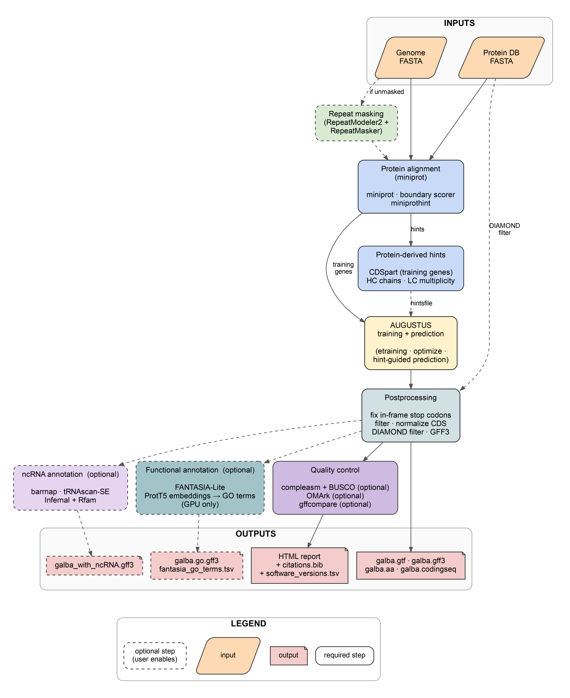

<p align="center"></p>

<p align="center">
  <a href="https://github.com/Gaius-Augustus/GALBA2/releases"></a>
  <a href="LICENSE"></a>
  
  
  <a href="https://github.com/Gaius-Augustus/GALBA2/commits/main"></a>
  <a href="https://github.com/Gaius-Augustus/GALBA2/issues"></a>
  <a href="https://github.com/Gaius-Augustus/GALBA2/stargazers"></a>
</p>

# GALBA2 — protein homology based genome annotation in Snakemake

Author: Katharina J. Hoff

Contact for Repository
========================

Katharina J. Hoff, University of Greifswald, Germany, katharina.hoff@uni-greifswald.de, +49 3834 420 4624

> **Migrating from GALBA (`galba.pl`)?** The fastest path to your first GALBA2 run is the dedicated step-by-step tutorial: **[MIGRATING_FROM_GALBA.md](MIGRATING_FROM_GALBA.md)**. It maps every `galba.pl` flag you already use to the equivalent `samples.csv` column or `config.ini` parameter, and walks through the translation with concrete examples.

Contents
========

-   [What is GALBA2?](#what-is-galba2)
-   [Keys to successful gene prediction](#keys-to-successful-gene-prediction)
-   [Protein database preparation](#protein-database-preparation)
-   [Installation](#installation)
    -   [Snakemake](#snakemake)
    -   [Singularity](#singularity)
-   [Running GALBA2](#running-galba2)
    -   [Preparing input files](#preparing-input-files)
        -   [samples.csv](#samplescsv)
        -   [config.ini](#configini)
    -   [Running locally](#running-locally)
    -   [Running on an HPC cluster with SLURM](#running-on-an-hpc-cluster-with-slurm)
    -   [Description of selected configuration options](#description-of-selected-configuration-options)
-   [Output of GALBA2](#output-of-galba2)
-   [Example data](#example-data)
-   [Bug reporting](#bug-reporting)
-   [Citing GALBA2 and software called by GALBA2](#citing-galba2-and-software-called-by-galba2)
-   [License](#license)

What is GALBA2?
================

GALBA2 is a Snakemake pipeline for genome annotation by protein homology, built on the [BRAKER4](https://github.com/Gaius-Augustus/BRAKER4) framework. It is designed for cases where no RNA-Seq data is available, but a database of protein sequences from related species exists. GALBA has only one prediction mode: miniprot aligns proteins to the genome, miniprothint extracts training genes and hints, AUGUSTUS is trained on those genes and then predicts with the protein-derived hints. There is no separate "EP" or "ETP" mode as in BRAKER.

GALBA2 is particularly useful for:

-   **Novel species** without RNA-Seq data, where a protein database from related species is available.
-   **Large-scale annotation projects** where dozens of genomes need to be annotated with the same protein database.
-   **Species with high-quality protein databases** (e.g. from OrthoDB) but no transcriptome evidence.

GALBA2 is a rewrite of the original [GALBA](https://github.com/Gaius-Augustus/GALBA) Perl pipeline (`galba.pl`, ~275 KB) as a Snakemake workflow. All bioinformatics tools run inside Singularity containers, so you do not install miniprot, AUGUSTUS, DIAMOND, or their dependencies on your system. Compared to `galba.pl`, GALBA2 adds:

-   **CSV-based multi-sample input** — annotate many genomes in a single run via `samples.csv`.
-   **Automatic resume** — re-run the same command after a failure and Snakemake picks up where it left off.
-   **Modular rules** in separate `.smk` files for easier debugging and extension.
-   **HPC-ready SLURM executor** — each rule can submit as a separate cluster job.
-   **Built-in repeat masking** — RepeatModeler2 + RepeatMasker (default) or Red (REpeat Detector; ~10× faster, no library), selectable via `masking_tool` in `config.ini`. Skipped automatically when you provide a pre-masked genome via `genome_masked` in `samples.csv`.
-   **Integrated QC and postprocessing** — GFF3 conversion (AGAT), DIAMOND filtering against the input proteins, BUSCO/compleasm completeness assessment, optional evaluation against a reference annotation (gffcompare).
-   **Optional CNN splice-site scoring** with minisplice (`use_minisplice = 1`).
-   **Optional non-coding RNA annotation** with barrnap (rRNA), tRNAscan-SE (tRNA), and Infernal against Rfam (snoRNA/snRNA/miRNA/ribozymes), merged into `galba_with_ncRNA.gff3` when `run_ncrna = 1`.
-   **Optional functional GO annotation** with FANTASIA-Lite (`run_fantasia = 1`, GPU-only).
-   **Optional OMArk proteome QC** (`run_omark = 1`).
-   **Auto-generated HTML report** with embedded plots, run-specific methods text, and a BibTeX file containing only the tools that were actually used.

<p align="center">
  
  <br>
  <em>Figure&nbsp;1. Overview of the GALBA2 pipeline. Solid borders mark required steps; dashed borders mark optional steps.</em>
</p>

Benchmark accuracy vs native galba.pl
======================================

To verify that GALBA2 reproduces the gene-prediction accuracy of the original `galba.pl` Perl pipeline, we run the same *Arabidopsis thaliana* genome (TAIR10 assembly, ~121 Mb) through both pipelines with matched configurations and score the resulting gene sets against the Phytozome Araport11 reference annotation using `gffcompare` v0.12.6 at the CDS level (`--strict-match -e 3 -T`).

**Inputs (identical for all pipelines):** TAIR10 genome FASTA (pre-softmasked), Viridiplantae proteins from OrthoDB v12 (~467 MB). All pipelines run with `optimize_augustus.pl` enabled. BRAKER4 EP (which uses ProtHint + GeneMark-EP+ instead of miniprot) is included as an additional reference point.

<table>
  <thead>
    <tr>
      <th rowspan="2">Pipeline</th>
      <th rowspan="2">Genes / loci</th>
      <th colspan="3" align="center">Locus</th>
      <th colspan="3" align="center">Exon</th>
      <th colspan="3" align="center">Base</th>
    </tr>
    <tr>
      <th>Sn</th><th>Pr</th><th>F1</th>
      <th>Sn</th><th>Pr</th><th>F1</th>
      <th>Sn</th><th>Pr</th><th>F1</th>
    </tr>
  </thead>
  <tbody>
    <tr>
      <td><code>galba.pl</code> (native Perl)</td>
      <td align="right">31,979 / 30,626</td>
      <td align="right">70.0</td><td align="right">63.4</td><td align="right">66.5</td>
      <td align="right">80.1</td><td align="right"><b>85.3</b></td><td align="right"><b>82.6</b></td>
      <td align="right">94.1</td><td align="right"><b>84.6</b></td><td align="right"><b>89.1</b></td>
    </tr>
    <tr>
      <td>GALBA2 (default)</td>
      <td align="right">32,333 / 30,747</td>
      <td align="right">70.4</td><td align="right">63.4</td><td align="right">66.7</td>
      <td align="right">80.8</td><td align="right">84.3</td><td align="right">82.5</td>
      <td align="right">94.7</td><td align="right">84.1</td><td align="right"><b>89.1</b></td>
    </tr>
    <tr>
      <td>GALBA2 + minisplice</td>
      <td align="right">32,172 / 30,642</td>
      <td align="right">70.2</td><td align="right"><b>63.5</b></td><td align="right">66.7</td>
      <td align="right">80.5</td><td align="right">84.1</td><td align="right">82.3</td>
      <td align="right">94.5</td><td align="right">83.9</td><td align="right">88.9</td>
    </tr>
    <tr>
      <td>BRAKER4 EP (reference)</td>
      <td align="right">34,834 / &mdash;</td>
      <td align="right"><b>77.0</b></td><td align="right">61.8</td><td align="right"><b>68.6</b></td>
      <td align="right"><b>83.2</b></td><td align="right">80.4</td><td align="right">81.8</td>
      <td align="right"><b>96.1</b></td><td align="right">80.4</td><td align="right">87.6</td>
    </tr>
  </tbody>
</table>

Sn = Sensitivity (% of reference features recovered). Pr = Precision (% of predicted features matching reference). F1 = harmonic mean of Sn and Pr (`2·Sn·Pr / (Sn+Pr)`). Higher is better. Bold marks the best value per metric column across all four pipelines.

**Reading the table.**

- **GALBA2 vs `galba.pl`** — GALBA2 matches the original Perl pipeline within measurement noise at every level: locus Sn/Pr 70.4/63.4 vs 70.0/63.4, exon Sn/Pr 80.8/84.3 vs 80.1/85.3, base Sn/Pr 94.7/84.1 vs 94.1/84.6. GALBA2 is marginally more sensitive (+0.4 locus Sn, +0.7 exon Sn, +0.6 base Sn); `galba.pl` is marginally more precise at the exon and base levels (+1.0 exon Pr, +0.5 base Pr). The two pipelines are interchangeable from an accuracy standpoint — GALBA2's reason for existing is the Snakemake-based execution model (multi-sample input, automatic resume, SLURM-native scheduling, containerised tools), not a change in prediction behaviour.
- **`+ minisplice`** — enabling CNN splice-site scoring (`use_minisplice = 1`, Yang et al., 2025) on this *A. thaliana* benchmark left locus-level accuracy essentially unchanged (Sn 70.2 / Pr 63.5 vs 70.4 / 63.4). For closely related protein evidence, minisplice is therefore off by default; it may still help on distant homologs or more repetitive genomes where miniprot's splice-site signal is weaker.
- **GALBA2 vs BRAKER4 EP** — GALBA2 has higher precision across all levels (locus 63.4 vs 61.8, exon 84.3 vs 80.4, base 84.1 vs 80.4); BRAKER4 EP has higher sensitivity (locus 77.0 vs 70.4) because ProtHint + GeneMark-EP+ cast a wider net, at the cost of more false positives. When closely related protein evidence is available, GALBA2 provides the more favourable balance.

**Where GALBA shines.** The *A. thaliana* genome (~121 Mb) is small. On larger genomes — which are common for many animal, plant, and fungal species — GALBA's miniprot-based approach scales much better than BRAKER2's ProtHint + GeneMark-EP+ pipeline. On genomes of 1 Gb and above, GALBA consistently outperforms BRAKER2 EP mode in both accuracy and runtime, because miniprot handles large, repeat-rich genomes more robustly than the Spaln/DIAMOND-based ProtHint alignment. If you are annotating a large genome with protein evidence only, GALBA2 is the recommended tool.

Keys to successful gene prediction
====================================

-   Use a high quality genome assembly. If you have a huge number of very short scaffolds, those will increase runtime but not prediction accuracy.

-   Use simple scaffold names in the genome file (e.g. `>contig1`). Complex headers can cause parsing issues.

-   The genome should be soft-masked for repeats. Soft-masking (lowercase letters for repeats) leads to better results than hard-masking (replacing with `N`). If you leave the `genome_masked` column in `samples.csv` empty, GALBA2 will mask the genome itself — by default using RepeatModeler2 + RepeatMasker, or using Red (REpeat Detector; Girgis, 2015) when you set `masking_tool = red` in `config.ini`. Red is ~10x faster and ~50x smaller as a container (~13 MB vs ~727 MB) at the cost of no repeat-family classification; it is a good default when you do not need the classified repeat library.

-   Always check gene prediction results before further usage. You can use a genome browser for visual inspection of gene models in context with protein alignments.

Protein database preparation
=============================

GALBA2 requires protein sequences from **closely related species** — this is different from BRAKER, which uses large OrthoDB partitions with distant homologs. GALBA relies on miniprot to produce high-quality spliced alignments, which works best with closely related proteins that share high sequence identity with the target genome.

**Recommended protein sources:**

-   Annotated proteomes from **4 or more closely related species** (e.g. from the same family or order). The more species, the better the coverage, but all should be reasonably close relatives.
-   Each protein must have a **unique identifier** in the FASTA header. If you combine proteomes from multiple species, ensure there are no duplicate IDs.
-   **Do NOT use large OrthoDB partitions** (e.g. all of Viridiplantae or Metazoa). These contain proteins from very distant species that produce poor miniprot alignments and lead to unreliable training genes. For such cases, use [BRAKER4](https://github.com/Gaius-Augustus/BRAKER4) instead, which uses ProtHint/GeneMark and handles distant homologs.

**Example:** To annotate a new grass species, combine the proteomes of *Oryza sativa*, *Zea mays*, *Sorghum bicolor*, and *Brachypodium distachyon* into a single FASTA file:

```bash
cat rice_proteins.fa maize_proteins.fa sorghum_proteins.fa brachy_proteins.fa > close_relatives.fa
```

Then specify it in `samples.csv`:

```csv
sample_name,genome,genome_masked,protein_fasta,busco_lineage,reference_gtf
my_grass,genome.fa,,close_relatives.fa,poales_odb12,
```

You can also provide multiple files colon-separated:

```csv
protein_fasta
rice_proteins.fa:maize_proteins.fa:sorghum_proteins.fa
```

Installation
============

**Platform requirement:** GALBA2 requires **Linux**. It relies on GNU coreutils (`readlink -f`), GNU grep (`grep -P`), and Singularity/Apptainer. If you are on macOS or Windows, run GALBA2 inside a Linux virtual machine or WSL2.

GALBA2 requires two things on your system: Snakemake and Singularity. All bioinformatics tools (miniprot, miniprothint, AUGUSTUS, DIAMOND, etc.) run inside the container. You do not need to install them.

Snakemake
---------

We recommend installing Snakemake with `pip` into a virtual environment:

```
python3 -m venv snakemake_env
source snakemake_env/bin/activate
pip install snakemake
```

GALBA2 supports SLURM as its HPC executor. Other schedulers (SGE, PBS, LSF) are not supported — if your cluster uses a different scheduler, run without `--executor slurm` and submit the Snakemake process itself as a single job, letting it execute rules locally within that allocation.

If you intend to run GALBA2 on an HPC cluster with SLURM, you also need the Snakemake SLURM executor plugin:

```
pip install snakemake-executor-plugin-slurm
```

Singularity
-----------

Singularity (or Apptainer, its open-source successor) must be installed on your system. On most HPC clusters, it is already available as a module:

```
module load singularity
```

GALBA2 will automatically pull the container image and convert it to a Singularity image on the first run.

**Container image:**

| Container | Image | Size | Used for |
| --- | --- | --- | --- |
| GALBA2 tools | `katharinahoff/galba2-tools:latest` | 112 MB | miniprot, miniprot_boundary_scorer, miniprothint, compleasm, matplotlib, BioPython — protein alignment, hint generation, completeness assessment, report plots |
| AUGUSTUS | `quay.io/biocontainers/augustus:3.5.0--pl5321h9716f88_9` | 249 MB | AUGUSTUS, etraining, DIAMOND, all Perl training/prediction scripts — training, prediction, postprocessing |
| AGAT | `quay.io/biocontainers/agat:1.4.1--pl5321hdfd78af_0` | 370 MB | GTF-to-GFF3 conversion |
| TE Tools | `dfam/tetools:latest` | 727 MB | RepeatModeler2 + RepeatMasker (only when `masking_tool = repeatmasker`) |
| Red | `quay.io/biocontainers/red:2018.09.10` | 13 MB | Fast repeat detection (only when `masking_tool = red`) |
| BUSCO | `ezlabgva/busco:v6.0.0_cv1` | 801 MB | BUSCO completeness assessment (optional) |
| barrnap | `quay.io/biocontainers/barrnap:0.9--hdfd78af_4` | 68 MB | rRNA prediction (only when `run_ncrna = 1`) |
| tRNAscan-SE | `quay.io/biocontainers/trnascan-se:2.0.12--pl5321h031d066_0` | 32 MB | tRNA prediction (only when `run_ncrna = 1`) |
| Infernal | `quay.io/biocontainers/infernal:1.1.5--pl5321h031d066_2` | 28 MB | Rfam scan for snoRNA/snRNA/miRNA (only when `run_ncrna = 1`) |
| OMArk | `quay.io/biocontainers/omark:0.4.1--pyh7e72e81_0` | 455 MB | OMArk proteome quality assessment (optional, only when `run_omark = 1`) |
| gffcompare | `quay.io/biocontainers/gffcompare:0.12.6--h9f5acd7_1` | 11 MB | Evaluation against a reference annotation (optional) |
| FANTASIA-Lite | `katharinahoff/fantasia_for_brain:lite.v0.0.2` | ~6 GB | Functional GO annotation via ProtT5 embeddings (optional, **GPU-only**) |

A standard GALBA2 run (no masking, no BUSCO) pulls only the GALBA2 tools + AUGUSTUS + AGAT containers: **~730 MB** total.

**Singularity bind paths:** Singularity containers can only see directories tha
t are explicitly bound. GALBA2 passes `--singularity-args "-B /home"` by default. If your data resides outside `/home` (e.g. in `/scratch`, `/data`, or `/gpfs`), you must add those paths:

```
--singularity-args "-B /home -B /scratch -B /data"
```

Running GALBA2
===============

Preparing input files
---------------------

GALBA2 requires two configuration files in your working directory: `samples.csv` and `config.ini`.

### samples.csv

This CSV file defines your input samples. Each row is one genome to annotate.

```csv
sample_name,genome,genome_masked,protein_fasta,busco_lineage,reference_gtf
```

**Columns:**

| Column | Required | Description |
|--------|----------|-------------|
| `sample_name` | yes | Unique identifier. Output goes to `output/{sample_name}/`. |
| `genome` | yes | Path to genome FASTA file. |
| `genome_masked` | no | Path to soft-masked genome. If empty, the unmasked genome is used directly. |
| `protein_fasta` | **yes** | Protein sequences in FASTA format. Multiple files can be colon-separated. We recommend OrthoDB. |
| `busco_lineage` | **yes** | BUSCO lineage for QC (e.g. `eukaryota_odb12`, `arthropoda_odb12`). |
| `reference_gtf` | no | Reference annotation for gffcompare evaluation. Optional. |

**Example: annotating two genomes in one run**

```csv
sample_name,genome,genome_masked,protein_fasta,busco_lineage,reference_gtf
fly,fly_genome.fa,,orthodb_arthropoda.fa,arthropoda_odb12,
plant,plant_genome.fa,plant_masked.fa,orthodb_viridiplantae.fa,viridiplantae_odb12,reference.gtf
```

You can also combine multiple protein sources by colon-separating them:

```csv
sample_name,genome,genome_masked,protein_fasta,busco_lineage,reference_gtf
my_species,genome.fa,,orthodb.fa:close_relative.fa,eukaryota_odb12,
```

### config.ini

This file contains pipeline parameters. Place it in the same directory as your `samples.csv`.

```ini
[paths]
samples_file = samples.csv
augustus_config_path = augustus_config
; busco_download_path = shared_data/busco_downloads      # optional, see "Pre-downloading BUSCO data" below
; compleasm_download_path = shared_data/busco_downloads/lineages  # optional, defaults to {busco_download_path}/lineages

[containers]
galba_tools_image = docker://katharinahoff/galba2-tools:latest    # miniprot, miniprothint, compleasm
augustus_image = docker://quay.io/biocontainers/augustus:3.5.0--pl5321h9716f88_9  # AUGUSTUS, DIAMOND

[PARAMS]
skip_optimize_augustus = 0          # set to 1 to skip AUGUSTUS optimization (saves time)
disable_diamond_filter = 0         # set to 1 to skip DIAMOND filtering of predictions
skip_busco = 0                     # set to 1 to skip the BUSCO pipeline
run_omark = 0                      # set to 1 to run OMArk (requires LUCA.h5 database)
run_ncrna = 0                      # set to 1 to annotate ncRNAs (rRNA, tRNA, snoRNA, miRNA)
translation_table = 1              # only table 1 (standard code) is currently supported
allow_hinted_splicesites = gcag,atac # non-canonical splice sites for AUGUSTUS
augustus_chunksize = 3000000        # genome chunk size (bp) for parallel AUGUSTUS prediction
augustus_overlap = 500000           # overlap (bp) between adjacent AUGUSTUS chunks
no_cleanup = 0                     # set to 1 to keep all intermediate files (debugging only)
use_dev_shm = 0                    # set to 1 to use /dev/shm for temp files (faster I/O)

[OMARK]
# omamer_db = /path/to/LUCA.h5      # OMAmer database for OMArk (used only when run_omark = 1)

[SLURM_ARGS]
cpus_per_task = 48
mem_of_node = 120000                # memory in MB
max_runtime = 4320                  # runtime in minutes (72 hours)
```

A ready-to-use template with all keys and per-option comments is shipped as [`config.ini.example`](config.ini.example). Copy it to your working directory and rename it:

```bash
cp /path/to/GALBA2/config.ini.example config.ini
```

Then edit the values as needed. The template keeps all comments on separate lines for compatibility with strict INI parsers; GALBA2 itself also accepts inline comments (`key = value  # comment`).

Every value in `[PARAMS]` and `[SLURM_ARGS]` can also be overridden via an environment variable named `GALBA2_<KEY_UPPER>`, e.g. `GALBA2_MAX_RUNTIME=240` or `GALBA2_SKIP_OPTIMIZE_AUGUSTUS=1`. Environment variables win over the file. The path of the file itself can be overridden with `GALBA2_CONFIG=/path/to/another.ini`.

Running locally
---------------

For running GALBA2 on a local workstation or a single compute node:

```
snakemake --cores 8 --use-singularity \
    --singularity-prefix .singularity_cache \
    --singularity-args "-B /home"
```

Adjust `--cores` to the number of CPU cores available.

Running on an HPC cluster with SLURM
--------------------------------------

For running on a SLURM-managed cluster:

```
snakemake \
    --executor slurm \
    --default-resources slurm_partition=batch mem_mb=120000 \
    --cores 48 \
    --jobs 48 \
    --use-singularity \
    --singularity-prefix .singularity_cache \
    --singularity-args "-B /home -B /scratch"
```

We recommend running the Snakemake master process in a `screen` or `tmux` session, or submitting it as a long-running SLURM job.

Description of selected configuration options
----------------------------------------------

| Option | Default | Description |
|--------|---------|-------------|
| `skip_optimize_augustus` | 0 | Skip `optimize_augustus.pl`. Saves hours on large genomes. **Do not enable for production runs** — optimization improves accuracy. |
| `disable_diamond_filter` | 0 | Skip DIAMOND filtering of AUGUSTUS predictions against input proteins. The filter removes gene predictions that have no sequence similarity match in the protein database. Disabling produces more genes but also more false positives. |
| `skip_busco` | 0 | Skip the BUSCO completeness assessment (slow). compleasm still runs. |
| `run_omark` | 0 | Run OMArk proteome quality assessment. Requires the LUCA.h5 OMAmer database (~8.8 GB). Download with `bash scripts/download_data.sh --omark`. Set the database path via `[OMARK] omamer_db = /path/to/LUCA.h5` in `config.ini` (or the `GALBA2_OMAMER_DB` environment variable). If unset, GALBA2 auto-discovers LUCA.h5 in `shared_data/` or sibling BRAKER4/BRAKER-as-snakemake repos. |
| `masking_tool` | repeatmasker | Repeat masking tool: `repeatmasker` (RepeatModeler2 + RepeatMasker, thorough but slow) or `red` (Red repeat detector, much faster). Only used when `genome_masked` column is empty. |
| `use_minisplice` | 0 | Use minisplice CNN splice site scores to improve miniprot alignment. Requires miniprot >= 0.14 and a pre-trained minisplice model (see [minisplice](https://github.com/lh3/minisplice)). Experimental. |
| `run_ncrna` | 0 | Annotate non-coding RNAs: rRNA (barrnap), tRNA (tRNAscan-SE), snoRNA/snRNA/miRNA (Infernal + Rfam). Requires Rfam database (~315 MB, downloaded by `scripts/download_data.sh`). |
| `run_fantasia` | 0 | Run FANTASIA-Lite functional GO annotation. **GPU-only** (requires NVIDIA GPU + pre-staged container and ProtT5 cache). See `[fantasia]` section in `config.ini`. |
| `translation_table` | 1 | NCBI genetic code table. **Currently only table 1 (standard code) is supported** because miniprot does not support alternative genetic codes. Support for additional tables is planned for a future release. |
| `no_cleanup` | 0 | Keep all intermediate files. Useful for debugging. |
| `use_dev_shm` | 0 | Use `/dev/shm` for temporary files during AUGUSTUS prediction (faster I/O on nodes with large RAM). |

### Downloading shared databases

GALBA2 ships a helper script to download shared databases:

```bash
# Download compleasm/BUSCO lineage cache directories
bash scripts/download_data.sh

# Also download the OMAmer database for OMArk
bash scripts/download_data.sh --omark

# Use a custom location (shared with BRAKER4 or other pipelines)
bash scripts/download_data.sh --shared-data /data/shared_databases
```

The script auto-discovers existing shared_data directories in sibling BRAKER4 or BRAKER-as-snakemake repositories to avoid redundant downloads.

### Pre-downloading BUSCO and compleasm data (offline / firewalled clusters)

By default, both BUSCO and compleasm download their lineage datasets and a `file_versions.tsv` manifest from `https://busco-data*.ezlab.org/` on the fly. On clusters without outbound internet access — or when the ezlab mirror is temporarily unreachable — this causes the pipeline to fail with messages like:

```
ERROR: Cannot reach https://busco-data2.ezlab.org/v5/data/file_versions.tsv
ERROR: BUSCO analysis failed!
```

GALBA2 uses lineage data from the ezlab mirror in two places — `busco` (at `busco_download_path`) and `compleasm` (at `compleasm_download_path`). Both must see the lineage on disk for a fully offline run. To avoid downloading the same data twice, GALBA2 defaults `compleasm_download_path` to `{busco_download_path}/lineages/` so that a single extracted tarball serves both tools.

GALBA2 detects pre-downloaded data automatically:

- If `{busco_download_path}/lineages/{busco_lineage}/dataset.cfg` exists, the BUSCO rules add `--offline` and skip the `file_versions.tsv` check. The `dataset.cfg` test matters — it tells a full BUSCO lineage apart from a compleasm-only download, which stores fewer files in the same location.
- If `{compleasm_download_path}/{busco_lineage}/` exists, compleasm reuses it via `-L` without contacting the mirror.

Each rule logs which path it took at the top of its log file.

**How to pre-download the data:**

1. Pick one shared directory for BUSCO and point `config.ini` at it in the `[paths]` section:

    ```ini
    busco_download_path = /data/shared/busco_downloads
    # compleasm_download_path  defaults to /data/shared/busco_downloads/lineages
    ```

    If unset, GALBA2 uses `<repo>/shared_data/busco_downloads/` and `<repo>/shared_data/busco_downloads/lineages/`.

2. On a machine with internet access, populate the cache once per lineage. Either let `busco` do it for you (recommended — it lays out the directory exactly the way both tools expect):

    ```bash
    busco --download fungi_odb12      --download_path /data/shared/busco_downloads
    busco --download eukaryota_odb12  --download_path /data/shared/busco_downloads
    # …repeat for every lineage in your samples.csv
    ```

    Or fetch the tarball with `wget`/`curl` and unpack it into the `lineages/` subdirectory:

    ```bash
    mkdir -p /data/shared/busco_downloads/lineages
    cd /data/shared/busco_downloads/lineages
    wget https://busco-data.ezlab.org/v5/data/lineages/fungi_odb12.2024-11-14.tar.gz
    tar -xzf fungi_odb12.2024-11-14.tar.gz
    # The extracted directory must be named exactly "fungi_odb12" (no date suffix).
    ```

3. The resulting layout serves both tools from the same files:

    ```text
    /data/shared/busco_downloads/
    └── lineages/                    <-- compleasm reads from here (-L)
        ├── fungi_odb12/             <-- BUSCO reads from here (--offline)
        │   ├── dataset.cfg
        │   ├── hmms/
        │   └── …
        └── eukaryota_odb12/
            └── …
    ```

4. Run GALBA2 as usual. If a lineage is missing, GALBA2 falls back to the normal online download — so this is safe to enable on internet-connected machines too, and new lineages added later will just be fetched on first use.

If you prefer to keep the two caches separate (e.g. an existing compleasm cache you do not want to move), set `compleasm_download_path` explicitly in `[paths]` and populate it independently — compleasm uses a flat layout (`{compleasm_download_path}/{lineage}/`, no `lineages/` subdirectory).

Output of GALBA2
=================

GALBA2 collects all important output files in `output/{sample}/results/`:

| File | Description |
|------|-------------|
| `galba.gtf.gz` | Gene predictions in GTF format |
| `galba.gff3.gz` | Gene predictions in GFF3 format |
| `galba.aa.gz` | Predicted protein sequences |
| `galba.codingseq.gz` | Predicted coding sequences |
| `galba_with_ncRNA.gff3.gz` | Gene predictions + ncRNA annotations (only when `run_ncrna = 1`) |
| `galba.go.gff3.gz` | GO-term decorated GFF3 (only when `run_fantasia = 1`) |
| `hintsfile.gff.gz` | Protein-derived hints used for prediction |
| `galba_report.html` | Pipeline report with statistics |
| `galba_citations.bib` | BibTeX citations for tools used |
| `software_versions.tsv` | Versions of all tools used |
| `quality_control/` | BUSCO/compleasm completeness, gene set statistics, training summary |

Example data
=============

GALBA2 ships with a small toy dataset in `test_data/` (a ~1 MB genome and ~119 KB protein set from the original GALBA test suite). To run the toy test locally:

```bash
cd test_scenarios_local/scenario_01_toy
bash run_test.sh
```

Additional local scenarios under `test_scenarios_local/`:

-   `scenario_02_red/` — toy dataset with Red repeat masking.
-   `scenario_03_busco_online/` — BUSCO with online lineage download.
-   `scenario_04_busco_offline/` — BUSCO with a pre-downloaded lineage (`--offline`).

For HPC benchmarks, see `test_scenarios/scenario_benchmark_athaliana*/`, which annotate the full *A. thaliana* genome with Viridiplantae proteins from OrthoDB.

Bug reporting
==============

Please report bugs and feature requests at https://github.com/Gaius-Augustus/GALBA2/issues

Before reporting a bug, please check:

-   Is your genome file in valid FASTA format with simple headers?
-   Is your protein database a multi-FASTA file with many representative proteins per family?
-   Do you have sufficient disk space? GALBA2 needs several GB for intermediate files.
-   Check the Snakemake log in `.snakemake/log/` for error details.
-   *Snakemake says the directory is locked and won't start!* Run with `--unlock` to clear the lock. If that does not help, delete the `.snakemake/` directory in your working directory and re-run — it holds only Snakemake metadata (locks, job tracking), not your output files.

Citing GALBA2 and software called by GALBA2
=============================================

Since GALBA2 is a pipeline that calls many bioinformatics tools, publication of results requires citing the tools that were actually used. **The HTML report (`galba_report.html`) automatically generates a complete, run-specific citation list and BibTeX file.** Use these for your publication — they include only the tools that were relevant to your particular run configuration.

The report and BibTeX file are located in:

```
output/{sample_name}/results/galba_report.html
output/{sample_name}/results/galba_citations.bib
```

Usage of AI
===========

The development of GALBA2 was assisted by AI tools:

-   **Claude** (Anthropic) was used for code generation and pipeline architecture. Most Snakemake rules, helper scripts, and the overall workflow design were developed in collaboration with Claude.
-   **Gemini** (Google) was used to generate the GALBA2 logo.

All AI-generated code was reviewed and tested by the authors. The pipeline was validated end-to-end on test data and the *A. thaliana* benchmark genome.

License
=======

See [LICENSE](LICENSE) for details.
